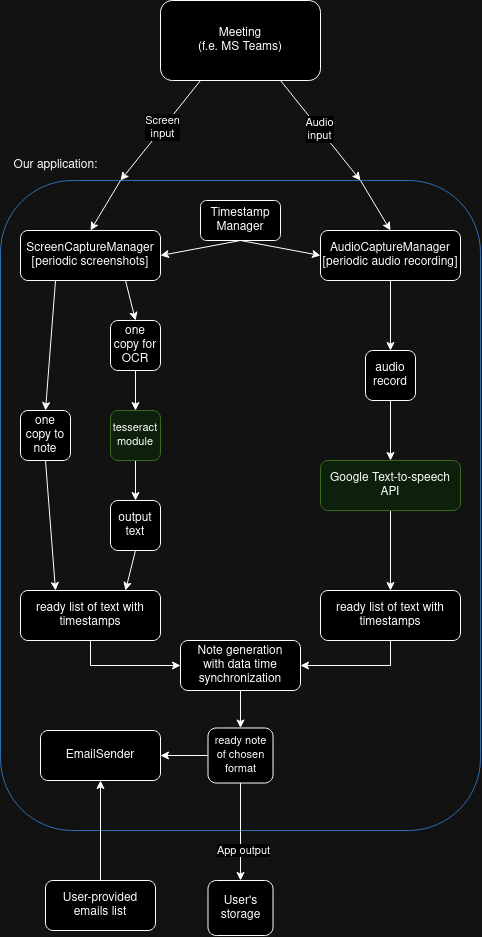

This document is a summary and report of *first project meeting*, where the team got to know the requirements and first details of the project, and of the *first team meeting*, where we discussed first implementation details and talked about tools to use.

# Team skills matrix

| Skill | Aleksander Brzykcy | Paweł Młodkowski | Stanisław Niemczewski |
| :---: | :---: | :---: | :---: |
| Documentation design | Basics | Basics | Basics | 
| C++ programming | Lower-intermediate | Lower-intermediate | Intermediate | 
| Java programming | Lower-intermediate | Basics | Lower-intermediate | 
| Python programming | Basics | Basics | Basics | 
| Software testing/QA | Basics | N/A | N/A | 
| Web applications development | N/A | N/A | N/A | 
| Agile/Scrum | N/A | Basics | Basics | 

# General Q&A

| Question | Answer | Additional notes |
| :--- | :--- | :--- |
| Which platforms should the app support? | At least Zoom, MS Teams, GoogleMeet. | | 
| What files formats should the app support? | Preferably .pdf, .html | Optionally: .txt and .md |
| Who should be able to use this app? | *E v e r y   u s e r.* | Regardless of how they will run the meeting (i.e. browser or desktop app) |
| May the users play chess during the meetings? | Frankly, no. | They also shouldn't be playing *Makumba* by *Big Cyc* in the background |

# Expected inputs / outline of application usage

The application is to be used by user to generate notes from the meeting, which shall be set up as follows:
1. User opens the meeting screen (f.e. browser or application window)
2. User runs our application with pointing which screen is to be recorded (the sounds output will be collected from master mix of the device)
	- **Note:** The user needs to have this window opened, to properly record the meeting contents. The user open other sound sources, which may disturb speech-to-text transcription.
3. The meeting proceeds and the data is parsed to temporary files...
4. After the meeting ends the data is finalized, and the emails are sent to provided emails (which may be changed during the meeting).

Above being said, the application needs device's **sounds source**, **indicated screen** and **email addresses of participants** to sends the reports to.

# Expected output / generated note

*Fig.1: Draft of an expected output note*

The note is to contain:
- **meeting title, duration, and some other metadata**;
- meeting contents (from top to bottom), repeated as many times as needed:
	- **made slide screenshots** from screen-capturing;
	- **screen transcription** underneath, as a description, from OCR[^1];
	- **speech transcription**.

Notes should be available as .txt, .md, .html and .pdf formats. The formats are to be generated as follows:
1. Generation of *.txt*: *Pure text transcription, with OCR[^1] and images references;*
2. Generation of *.md*: *Made of objects provided by external libraries, which shall be the same as the contents of .txt files, but with additional formatting, embedded image references and ready to read with Markdown readers;*
3. Generation of *.html*: *Made of ready .md file, which may be directly converted to HTML format;*
4. Generation of *.pdf*: *Made of ready .html file, which only requires a few additional meta-data, such as font family, font size, etc.*

The notes are to be **always** be generated in all of formats specified above.

# General outline and system model

Code does this and that.

*Fig. 2: An UML diagram of general application structure*

*Fig. 3: An UML diagram of end process schema*

Above diagrams picture how should the data flow look in this application - what "end-point" should provide what "data".

# Implementation and work schema 

### Tools:
- Development environment: **Qt** (C++)
	- probably with some CMake/bash scripts help for building purposes
	- **Microsoft C++ VS** compiler (version to be specified)
	- in addition to standard library, the project will make use of external libraries:
		- [json parsing library](https://github.com/nlohmann/json)
		- [voice to speech library - whisper dock](https://github.com/ErcinDedeoglu/WhisperDock)
		- [curlpp for HTTP requests](https://github.com/jpbarrette/curlpp)
		- [screen capture library](https://github.com/JKnightGURU/ScreenCaptureLib)
		- [OCR from image library](https://github.com/tesseract-ocr/tesseract)
- OS: **Windows 10 and 11**
- additional needed software: **Docker**

### Organisation framework

**Agile**: **weekly reports** with **regular meetings**, including live workshops and ad-hoc meetings.

[Clickup](https://clickup.com) is the tool of choice to provide the team with Kanban boards and other organisation-helping tools.

[Slack](https://slack.com) is the communication tool, provided by the AGH, to make our communication easier and transparent for others.

[Github](https://github.com/stas420/2ects_io_project) is our software version control tool, where we share the source code, instructions of usage, documentation, and every other project-related thing. The contributors are visible in the repo details.

# In-depth application structure

Using framework mentioned above, the application flow should look like below:

*Fig. 4: A detailed UML diagram of application structure, picturing usage of chosen modules*

The application should provide this using **Qt** framework over **C++** language, which also provides customizable **GUI** tools and development environment.